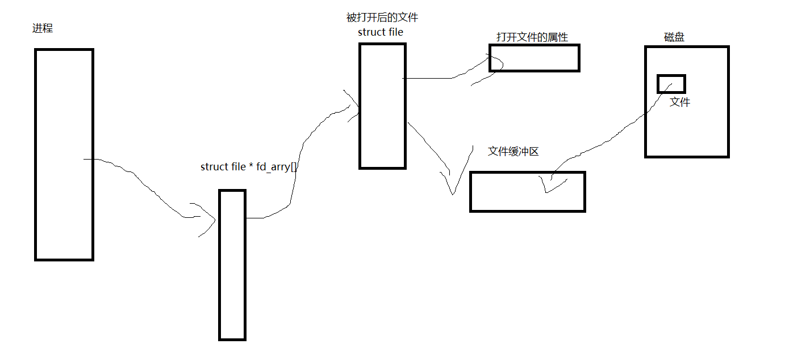

# 文件操作

## 一、预备工作

1.文件 = 文件内存 + 文件属性（即使是空文件，但是文件的属性是要占用内存磁盘空间的）

2.文件操作：对属性操作/对内存操作

3.打开文件：打开的本质是把文件的内存加载到内存，

4.一个进程可以打开多个文件，多个进程可以打开多个文件 

5.os打开文件的时候是如何管理的：通过一个文件结构体描述文件的属性，然后对文件的操作就是要通过这个结构体去实现对文件操作

## 二、复习c的文件的接口

```c
fopen
fclose


#include<stdio.h>
#include<unistd.h>
#include<sys/wait.h>
#include<sys/types.h>
#include<stdlib.h>

int main(int argc,char * argv[])
{
    FILE * fp = fopen("log.txt","w");
    //这个的打开会截断文件，直接截断为0，w改成a的话就是追加了
    if(NULL == fp)
    {
        perror("fopen error");
        exit(-1);
    }
    int cnt = 10;
    while(cnt--)
        fputs("hello \n",fp);

    fclose(fp);


    return 0;   
}
```

## 三、认识系统的文件接口

1.用于操作系统不相信我们，所以操作系统给到了我们接口，标准IO也就是对系统调用的封装

### 3-1：打开文件和关闭文件

```c
/* 
    作用：打开文件
	参数：flags---打开文件的方式 O_RDONLY, O_WRONLY, or O_RDWR,O_APPEND,O_CREAT ,O_TRUNC
	返回值： 成功为文件描述符号，失败为-1
	
*/

int open(const char *pathname, int flags);
int open(const char *pathname, int flags, mode_t mode);

/* 
    作用：关闭文件
	参数：要进行关闭文件的fd
	返回值：成功为0，失败为-1
	
	
*/

int close(in fd);

#include<stdio.h>
#include<unistd.h>
#include<sys/wait.h>
#include<sys/types.h>
#include<stdlib.h>
#include<sys/types.h>
#include<sys/stat.h>
#include<fcntl.h>
int main(int argc,char * argv[])
{
    umask(0);
    int fd = open("./log.txt",O_WRONLY|O_CREAT,0666);
    if(fd < 0)
    {
        perror("open error");
        return -1;
    }

    close(fd);


    return 0;   
}

```

### 3-2：读写文件

```c
/*
	作用：对文件进行写入
	参数：fd---要写入的文件
		 buf---要写入数据的首地址
		 size---写入数据，字节单位
	返回值：
*/
int wrtie(int fd,const void * buf,size_t size);


/*
	作用：对文件进行读取
	参数：fd---要读取的文件
		 buf---要读取数据的存放首地址
		 size---读取的字节数
    返回值：
*/
int read(int fd,const void * buf,size_t size);
```

### 3-3：文件描述符

#### 3-3-1：如何进行描述的

1.每个进程的文件描述队列都是独立的


1.PCB里面有一个文件结构体指针数组，里面的内容是指向打开文件调度PCB结构体

2.下标的序号就是文件描述符

#### 3-3-2：0，1，2到哪里去了

0表示标准输入 STDIN_FILENO

1表示标准输出 STDOUT_FILENO

2表示标准错误 STDERR_FILENO

### 3-4：Linux一切皆文件

1.不提，当年在学驱动的时候知道底层是什么样子了


## 四、文件的重定向

### 4-1：理解struct file对象

1.struct file是一个用于描述打开文件的结构体，里面存放在读写位置，文件的属性等等。

2.task_struct有一个struct file * 用于存储文件系统的信息，struct file*里面有一个成员fd_array[]存储这每一个打开后文件的文件描述结构体指针，而文件描述符就好该数组的下标

3.我们在读取文件的时候会先把文件的数据读取到内核缓冲区中（这一步显然就是由操作系统来做了），然后再把数据写入到用户指定的区域。写文件也是同样的道理

4.总的来说读写文件就是对内核缓冲区的拷贝



#### 4-1-1：介绍一下struc file里面几个比较重要的成员

```c
//这是对文件的读写集合函数，这样就可以实现不同的文件读写函数的不一样
const struct file_operations;
//文件描述结构体的引用个数，在dup2或者dup的时候会出现俩个文件描述符指向同一个文件
unsigned int f_count;
//文件打开的方式
unsigned int f_flags;

```

### 4-2：fd的分配规则

1.从下往下进行扫描，找到最小没有被使用数组的位置

```c
#include<stdio.h>                                                           
#include<sys/types.h>
#include<sys/stat.h>
#include<fcntl.h>
#include<unistd.h>
int main()
{
    //关闭0号文件描述符（0号是标准输入）
    close(0);
	
    
    //打开一个文件
    int fd = open("log.txt",O_RDWR|O_CREAT,0666);

    //此时fd为0，因为0号被关闭了，所以数组下标为0的地方没有被使用
    printf("the fd is %d\n",fd);
    return 0;
}

```

### 4-3：重定向

1.一个进程启动的时候会被打开3个文件0，1，2分别为标准输入，标准输出，标准错误

#### 4-3-1：输出重定向

1.验证0默认标准输入，1为标准输出

```c
#include<stdio.h>
#include<sys/types.h>
#include<sys/stat.h>
#include<fcntl.h>
#include<unistd.h>

char buf[1024];
int main()
{
    //此时我们直接读取0号描述，就是从键盘进行读取
	ssize_t size = read(0,buf,1024);
	if(size > 0)
	{
		buf[size] = '\0';
        //此时我们直接1号描述写入，写入到显示屏
		write(STDOUT_FILENO,buf,size);
	}

	return 0;
}
```

2.进行重定向

```c
#include<stdio.h>
#include<sys/types.h>
#include<sys/stat.h>
#include<fcntl.h>
#include<unistd.h>

char buf[1024];
int main()
{
    close(0);
    
    //由于前面关闭了0号文件描述符，此时打开log.txt文件，其描述符就是0
    int fd = open("log.txt",O_RDONLY);
    
    //此时我们直接读取0号，就是对log.txt进行读取
	ssize_t size = read(0,buf,1024);
	if(size > 0)
	{
		buf[size] = '\0';
        //此时我们直接1号描述写入，写入到显示屏
		write(STDOUT_FILENO,buf,size);
	}

	return 0;
}
```


#### 4-3-2：输出重定向 

```c
#include<stdio.h>
#include<sys/types.h>
#include<sys/stat.h>
#include<fcntl.h>
#include<unistd.h>

char buf[1024];
int main()
{
    close(0);
    close(1);
    
    //由于前面关闭了0号文件描述符，此时打开log1.txt文件，其描述符就是0
    int fd1 = open("log1.txt",O_RDONLY);
    //由于前面关闭了0号文件描述符，此时打开log2.txt文件，其描述符就是1
    int fd2 = open("log2.txt",O_WRONLY|O_CREAT,0666);

    //此时我们直接读取0号，就是对log1.txt进行读取
	ssize_t size = read(0,buf,1024);
	if(size > 0)
	{
		
		buf[size] = '\0';
        //此时我们直接1号描述写入，写入到log2.txt
		write(1,buf,size);
	}

	return 0;
}
```

#### 4-3-3：总结

1.输入和输出的重定向就是本来让指向显示屏或者键盘的文件指向我们打开的文件（比如log.txt）


#### 4-3-4：dup2

1.通过关闭然后再打开的方式确实多少有点拉，所以我们就来学一个系统调用

```c
/*
	作用： The  steps  of  closing  and reusing the file descriptor newfd are per‐
       formed atomically.也就是把newfd下标存储的指针改写为oldfd下标存储的指针
    参数：newfd---被覆盖文件描述符
    	 oldfd---覆盖文件描述符
    返回值：成功为新的文件描述符，失败为-1
	
*/

int dup2(int oldfd, int newfd);
```

2.实例

```c
#include<stdio.h>
#include<sys/types.h>
#include<sys/stat.h>
#include<fcntl.h>
#include<unistd.h>

char buf[1024];
int main()
{

    
    
    int fd1 = open("log1.txt",O_RDONLY);
    
    int fd2 = open("log2.txt",O_WRONLY|O_CREAT,0666);

	//把标准输入覆盖为fd1
	dup2(fd1,STDIN_FILENO);
    //把标准输出覆盖为fd2
	dup2(fd2,STDOUT_FILENO);

    //此时我们直接读取0号，就是对log1.txt进行读取
	ssize_t size = read(0,buf,1024);
	if(size > 0)
	{
		
		buf[size] = '\0';
        //此时我们直接1号描述写入，写入到log2.txt
		write(1,buf,size);
	}

	return 0;
}
```

把myshell的重定向功能补充上

**为什么程序替换不会影响从重定向**：程序替换知识修改了虚拟地址的映射和task_struct的pc指针。没有修改struct file*的内存


### 4-4：缓冲区

#### 4-4-1：预备知识 

##### 4-4-2：缓冲区是什么

1.先说个故事：一个快递站要发快递去出去，那么它是一个快递就安排一辆车送出去，还是说等快递到达一定的数量在发送出去，显然是等到一定的数量才发出去


2.那么所谓的缓冲区也是同一个道理的：我们每次调用c的标准库要进行IO操作，如果只是写入一个字符就要进入到操作系统指向操作系统的指令，那么出现多个小数据的时候就会反复进入到内存，这样我们的用户代码就会被执行得很慢，所以就需要缓冲区，把要写入文件的数据弄到一个缓冲区里面，等到缓冲区满了或者其他条件在进行写入到内核缓冲区


3.刷新条件：问题来了，缓冲区的内容什么时候写入到内核中去，这就涉及到刷新方式，常见的是俩种：全缓存和行缓冲，全缓冲是等到缓冲区写满了在写入到内核中去，行缓冲是遇到\n的时候写入到内核中去。磁盘文件是全缓冲区，显示屏文件时行缓冲。


#### 4-4-2：dome

```c
#include<stdio.h>                                                           
#include<unistd.h>
#include<string.h>
#include<sys/types.h>
#include<fcntl.h>
#include<sys/stat.h>


int main(int argc,char * argv[])
{
     const char * buf = "SYS_CALL\n";
     printf("hello yjt\n");
     printf("hello uea\n");
     write(STDOUT_FILENO,buf,strlen(buf));
     fork();
     return 0;
}


/* 
	./test 和 ./test > log.txt 这俩者执行的区别是什么 
	
	./test：因为显示器是行缓冲，所以俩个printf的内容在fork之前就被刷到内核中去了
	./test > log.txt 因为进行重定向，此时printf是对文件进行写入，所以是全缓冲，fork之后缓冲区的内存还是在的。所以log.txt有俩份关于printf的内存
	
	
*/
```

#### 4-4-2：封装一俩个函数

## 五、文件系统

1.在前面的内容中，我们已经学了在内存中对文件的管理，现在来学习磁盘上对文件的管理

### 5-1：磁盘管理

1.本质上是为了快速定位文件（通过路径）

#### 5-1-1：磁盘的物理结构

1.磁盘是如何写入数据的 ？

2.我们先来了解一下磁盘的物理结构是什么样的 ： 


3.磁头：

4.磁道：

5.扇区：

6.如何定位到对应区域：定磁头，定磁道，定扇区

#### 5-1-2：从物理到软件

1.显然我们不能直接使用CHS来写软件，所以我们要做一个转化。

2.通过一个数组来描述磁盘，数组的下标通过一定的转化就可以得到磁盘具体位置


3.分块管理：

#### 5-1-3：分区的概念

1.国家那么大的土地，要管理。肯定不能直接中央管理，所以就需要分级管理。

2.对于磁盘的管理也需要分区。

3.100GB还是太大了，我们在进行分组，2个GB

里面要有文件信息 + 管理文件的数据

### 5-2：文件系统


1.我们要管理文件，所以就需要对文件进行描述：那么在磁盘中就会有文件的信息和数据 

接下来我们就有俩个问题：我们如何找到信息和如何找到数据 ： 5-2-1和5-2-2进行解答

2.通过：5-2-1和5-2-2我们就可以知道文件最基本的管理：读取文件就是通过inode编号定位到分区的一个分组内，然后通过被inode（被取模后的inode）在inode表中找到文件的属性里面的一个用于保存文件使用了那些块的字段，在通过这个属性找到数据块，进而读取出数据。

3.我们要创建一个文件呢？就要给他分配inode和磁盘块，或者对一个文件增加内容也需要分配磁盘块，那么我们就需要知道那些inode被使用，那些磁盘块被使用？这些通过是怎么做的呢？5-2-3

4.通过上面的学习我们就可以解答3的问题，在创建文件的时候先在到从inodebitmap中找到一个没有被使用的inode，然后通过得到的inode把文件属性写入到inode表中，分配数据块也是同理，通过扫描blockbitmap扫描到没有被使用的磁盘块，填写到inode表对应的字段里面。那么我们也可以推出删除文件干了些什么。

5.我们的字段里面是15个用于描述使用了那些磁盘块，如果文件的大小超过了15个呢？EXT2文件系统

6.GDT表：有多少个inode，被使用了多少个，磁盘块有多少，被使用了多少块，下次使用inode，下次使用的磁盘号

7.SuperBlock：这个不属于块组，用于描述分区的信息，可能在几个组里面有，为什么专门划一块空间进行存储？如果那一块炸了，磁盘就炸了，为了保险起见所以有了备份。

8.那么我们的文件是如何通过文件名转化到inode的呢？5-2-4

9.分区问题：你要访问一个文件，是通过inode，inode是在分区内有效，那么我们如何找到分区？一个磁盘被分区格式化之后要进行挂载！分区挂载到目录下，访问对目录就是已经确定好了分区。

10.fopen打开一个文件做了什么时候呢？fwrite fread 做了些什么事情

#### 5-2-1：inode和inode表

1.前面说我们要找到文件的信息，你那么就要知道文件的信息是如何被管理的。

2.在每一个分组中，都有一个inode表，用于存在文件的信息，inode是固定大小的（磁盘空间有限），这里我们可以抽象称应该结构体数组（struct inode_table[1024] ），那么我们要找文件信息就是去这个数组里面找。那么接下来又有文件了，我们知道数组里面的成员是哪一个文件的，再有如何通过文件名去查找

3.inode编号：每一个文件都有对应的inode编号，那么inode表的下标就是对应的文件的inode编号。举个例子，/home/yjt/test.c文件的inode为100101，那么这个文件的属性就存放在inode_table[10011]上面。


4.如图：文件信息存在inode表中，是通过数组形式组织起来的，我们的inode文件编号就是数组的下标

```c
typedef struct 
{
	//读写时间
    //大小
    //占用的磁盘空间等等
    int data_block[15];
}inode; 

inode[1024];

```

5.由于我们前面说了会对分区进行分组工作，组和组之间的inode有关系?简单的来说每一个组都有应该起始inode，比如组1是0，组2是1024，组3是2048。

#### 5-2-2：数据存放data_block

1.我们的文件是如何找到数据存在的地方：inode有一个字段用于存放着文件占用了磁盘块，通过这个字段就可以进行索引。

```c
typedef struct 
{
	//读写时间
    //大小
    //占用的磁盘空间等等
    int data_block[15]; //140 520 130
}inode; 

inode[1024];

```

2.data_block里面存在就是这个文件占用了那些磁盘块的编号。


#### 5-2-3：inodebitmap和blockbitmap

1.如何知道inode是否被使用？？再磁盘中还存放着一个内容，叫inodeBitmap，这事一个位图是一个用于表示某一个inode数组有没有被占用，我们再创建文件的时候就需要先inodeBitmap中查询出一个没有被使用的inode编号。

2.在前面我们学习过位图，这里不详细解读

3.blockbitmap ：和inodebitmap相同的道理的用于查看那一块磁盘没被占用

#### 5-2-4：文件名字到inode转化，目录是如何存放在磁盘里面

1.目录是如何在磁盘在存储的呢？同样都是文件属性+数据，属性我们很好理解，数据存放的是什么？存放的是该目录下的文件和对应的inode。

2.我们要读取一个文件是不是找到该文件的目录里面的数据，从中提取出对应inode。

3.操作系统会把根的inode放在内存中

Linux中没有文件名。

对于高频访问文件的问题。

#### 5-2-5：链接文件

什么是软连接：类似于win下的快捷方式，有独立的inode

软链接是怎么做到的呢？其问的内容是指向文件的路径


硬链接：同一个文件名，不同inode，也就是一个计数器，我们可以理解为在目录内容里面写入了一个文件名，并且和目标文件指向同一个inode，引用计数问题。

区别

.和..文件是是系统给你搞的硬链接，但是你自己不可以这样玩！！！

### 5-2：动静态库

#### 5-2-1：动态库.so

1.在程序链接的时候还有一种链接方式就是动态链接，对于很大啊的库文件我们不接直接链接到我们的可执行文件中，而是等到我们需要用到这个库文件的时候在去磁盘中进行寻找！

2.动态链接库的制作

```shell
libmymath.so : main.o add.o sul.o div.o
	gcc -shared -o $@ $^			#gcc -shared表示的是把.o编译为动态链接库

%.o : %.c  					#把.c文件编译为.o文件，-fPIC的作用是表示该.o文件是位置无关吗
	gcc -fPIC -c $<


.PYHON:Output
Output:
	mkdir -p ./mymath/lib
	mkdir -p ./mymath/include
	cp  *.h ./mymath/include
	cp  libmymath.so ./mymath/lib
.PYHON:clean
clean:
	rm -rf *.o main
```

3.编译动态链接库

```shell
gcc -o main -lmymath -L ./ #这基本上和普通的库文件没什么区别
```

4.但是我们在执行这个文件的时候会出现问题，什么问题呢？你在编译的时候告诉了编译器但是你在执行的时候并没有和系统说要去哪里进行动态的链接，所以我们告诉系统去哪里进行链接

```shell
#4-1：直接就是安装到系统（lib64）里面，直接拷贝就ok了
sudo cp *.so /usr/lib
#4-2：动态链接库在会当前目录进行查找，那么我们就可以搞一个软链接链接到该库
ln -s *so targt(软连接的名字)
#那么我们是不是就可以直接就是在/usr/lib下创建对应的软链接（Ubuntu似乎是真的不行！！！）

#4-3：配置环境变量 LD_LIBRARY_PATH
export LD_LIBRARY_PATH=$LD_LIBRARY_PATH:/home/yjt/biji/lib/dylib/test/lib这个环境变量是在执行的是进行动态链接库链接的路径，把你的动态链接库的路径切入到这个变量中就好了
#4-4：修改/etc/ld.so.conf文件
在这个文件夹里面创建一个文本文件里面保存你的动态链接库的路径就可以了
```

#### 5-2-2：动态库加载

1.什么是动态库加载？动态链接动态链接对于动态链接库不会直接被链接到我们的可执行文件，所以我们的代码需要库文件里面的实现就需要，就比如printf函数就是一个动态链接的函数，是不会被链接可执行文件中，所以需要去磁盘中把库文件链接到内存中。


2.大体上是如何加载的呢？在我们可执行程序需要执行动态链接库的方法的时候，操作系统就会把磁盘的内存加载到内存中，然后我们通过映射到共享区，那么我们通过虚拟内存的共享区+页表就可以访问到动态链接库了


3.那么具体一点是如何加载的呢？我们都知道一个程序被编译的时候是要属于自己的地址的，那么我们的动态链接库的时候也会有地址。

我们需要访问动态库的时候回去查表，查看是否映射到虚拟地址中了，如果没有根据表中查找动态库在磁盘的位置，并且加载到内中，然后继续映射到虚拟中，我们只需要在表中填写对应动态链接库地址，然后再通过对应方法的偏移量找到即可。再多个进程依赖一个库的时候，只需要把内存中的库映射到虚拟中就好了，然后通过地址加偏移量的方法进行访问就好了


#### 5-2-3：静态库

1.什么是静态链接库？我们在加载库文件的时候又俩种，一直是直接把库文件对应需要的函数直接链接到我们的目标文件中这种方式就是可执行文件（后缀.a）

2.我们之前学过可以通过.o文件直接进行链接，但是哈这种如果你又很多很多个.o文件是不是很不方便？所以我们可以把这些文件.o文件直接打包成静态库

3.如何制作静态库？

```makefile
main : main.o add.o sul.o div.o
	gcc -o $@ $^

%.o : %.c       #把.c文件编译为.o文件
	gcc  -c $<


.PYHON:Output  
Output:
	ar -r libmymath.a  add.o div.o sul.o  #把.o文件编译为静态链接库
	mkdir -p ./mymath/lib
	mkdir -p ./mymath/include
	cp  *.h ./mymath/include
	cp  libmymath.a ./mymath/lib
.PYHON:clean
clean:
	rm -rf *.o main
	
	
#ar -rc xxx.a xxx.o xxx.o xxx.o
```


4.使用静态库：

```shell
gcc -o main main.o -lmymath -L ./

#-l+库名字 -L + 库的路径
```

5.默认编译是动态链接，如果你的库只有静态链接，那么就会是静态链接

6.如果不想加那么多选项可以把库文件和头文件分别拷贝到/usr/include和/usr/lib下

